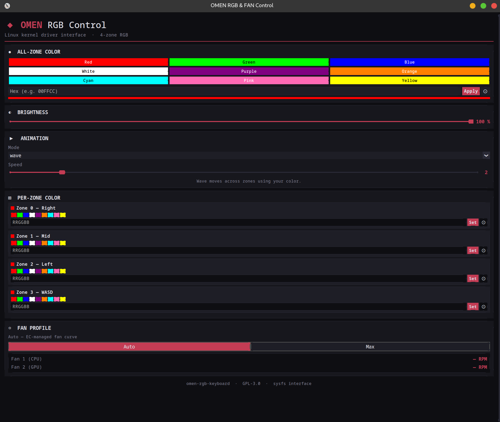
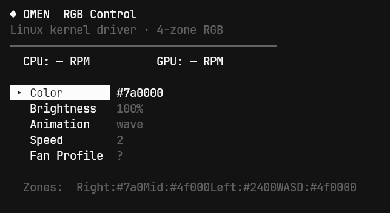

<p align="center">
  <h1 align="center">◆ omenctl</h1>
  <p align="center">
    <b>HP OMEN RGB Keyboard & Fan Control for Linux</b><br>
    <sub>GUI · TUI · CLI — all in one tool</sub>
  </p>
</p>

<p align="center">
  <a href="#features">Features</a> •
  <a href="#screenshots">Screenshots</a> •
  <a href="#prerequisites">Prerequisites</a> •
  <a href="#installation">Installation</a> •
  <a href="#usage">Usage</a> •
  <a href="#references">References</a> •
  <a href="#license">License</a>
</p>

---

## Overview

**omenctl** is a userspace control tool for HP OMEN laptops running Linux. It provides a polished **GUI** (CustomTkinter), a keyboard-driven **TUI** (curses), and a full **CLI** — all talking directly to the [`omen-rgb-keyboard`](https://github.com/OmenLinux/omen-rgb-keyboard) kernel driver via sysfs.

Control your 4-zone RGB keyboard lighting, animation modes, brightness, and fan profiles without rebooting into Windows or touching OMEN Gaming Hub.

## Features

| Feature | GUI | TUI | CLI |
|---|:---:|:---:|:---:|
| 4-zone RGB color control | ✅ | ✅ | ✅ |
| All-zone color (one command) | ✅ | ✅ | ✅ |
| Per-zone individual colors | ✅ | — | ✅ |
| 9 preset colors | ✅ | ✅ | — |
| Custom hex color input | ✅ | ✅ | ✅ |
| Native color picker dialog | ✅ | — | — |
| Brightness slider (0–100%) | ✅ | ✅ | ✅ |
| 11 animation modes | ✅ | ✅ | ✅ |
| Animation speed control (1–10) | ✅ | ✅ | ✅ |
| Fan profile (Auto / Max) | ✅ | ✅ | ✅ |
| Live fan RPM monitoring | ✅ | ✅ | ✅ |
| Auto-elevates to root | ✅ | ✅ | ✅ |
| Wayland / XWayland support | ✅ | ✅ | ✅ |

### Animation Modes

`static` · `breathing` · `rainbow` · `wave` · `pulse` · `chase` · `sparkle` · `candle` · `aurora` · `disco` · `gradient`

> Modes like `rainbow`, `candle`, `aurora`, and `disco` generate their own colors.  
> Modes like `breathing`, `wave`, `pulse`, `chase`, `sparkle` use your chosen color.

## Screenshots



<!-- Add screenshots of the GUI and TUI here -->
<!--  -->
<!--  -->

## Prerequisites

### 1. Kernel Driver (Required)

This tool requires the **omen-rgb-keyboard** kernel driver to be installed and loaded. The driver exposes sysfs nodes at:

```
/sys/devices/platform/omen-rgb-keyboard/rgb_zones/
```

#### Install the kernel driver:

```bash
# Install build dependencies
# Arch Linux
sudo pacman -S linux-headers base-devel alsa-lib

# Fedora
sudo dnf install kernel-devel kernel-headers @development-tools dkms alsa-lib-devel

# Ubuntu / Debian
sudo apt install linux-headers-$(uname -r) build-essential libasound2t64

# Clone and build
git clone https://github.com/OmenLinux/omen-rgb-keyboard.git
cd omen-rgb-keyboard
sudo make install
```

#### Blacklist conflicting module:

> [!IMPORTANT]
> The `hp_wmi` module conflicts with this driver. Blacklist it:

```bash
sudo modprobe -r hp_wmi
echo "blacklist hp_wmi" | sudo tee /etc/modprobe.d/blacklist-hp.conf
```

#### Load the driver:

```bash
sudo modprobe omen_rgb_keyboard
```

#### Verify it loaded:

```bash
lsmod | grep omen_rgb_keyboard
ls /sys/devices/platform/omen-rgb-keyboard/rgb_zones/
```

You should see files like `zone00`, `zone01`, `zone02`, `zone03`, `all`, `brightness`, `animation_mode`, `animation_speed`, etc.

#### (Optional) Allow non-root access:

```bash
cd omen-rgb-keyboard
sudo ./install-udev-rules.sh
# Log out and back in, or run: newgrp input
```

### 2. Python Dependencies

```bash
# GUI requires CustomTkinter
pip install customtkinter

# TUI and CLI use only the Python standard library (no extra deps)
```

### 3. Fan Control (hwmon)

Fan RPM and profile control uses the hwmon sysfs interface. The path defaults to `/sys/class/hwmon/hwmon5`. If your system uses a different hwmon index, update `FAN_PATH` in both `omenctl` and `utils.py`.

Check your fan hwmon path:

```bash
for d in /sys/class/hwmon/hwmon*/; do
  name=$(cat "$d/name" 2>/dev/null)
  echo "$d -> $name"
done
```

## Installation

```bash
# Clone the repo
git clone https://github.com/SwarritSrivastava/omenctl.git
cd omenctl

# (Optional) Make omenctl globally available
sudo cp omenctl /usr/local/bin/
sudo chmod +x /usr/local/bin/omenctl
```

## Usage

### GUI (default)

```bash
# Launch the graphical interface (auto-elevates to root)
omenctl
# or explicitly:
omenctl gui
```

The GUI features:
- Color preset buttons and hex input with color picker
- Per-zone RGB control with individual swatches
- Brightness and speed sliders
- Animation mode dropdown with descriptions
- Fan profile toggle with live RPM readout

### TUI (Terminal UI)

```bash
omenctl tui
```

Navigate with arrow keys, adjust values with ←/→, press Enter to type a hex color, `q` to quit.

### CLI

```bash
# Show current hardware state
omenctl status

# Set all zones to a color
omenctl color FF0000

# Set a specific zone (0-3)
omenctl color 00FF00 -z 2

# Adjust brightness (0-100)
omenctl brightness 75

# Set animation mode
omenctl mode rainbow

# Set animation mode with speed
omenctl mode breathing -s 3

# Set animation speed (1-10)
omenctl speed 5

# Set fan profile
omenctl fan auto    # EC-managed fan curve
omenctl fan max     # Full speed
```

### Zone Map

| Zone | Location |
|------|----------|
| 0 | Right section |
| 1 | Middle section |
| 2 | Left section |
| 3 | WASD keys |

## Project Structure

```
omenctl/
├── omenctl          # Main entry point — CLI, TUI, auto-elevation logic
├── utils.py         # GUI (CustomTkinter) + OmenDevice hardware interface
├── README.md
├── LICENSE
└── .gitignore
```

## How It Works

```
┌─────────────────────────────────────────────────┐
│  omenctl (Python)                               │
│  ┌──────────┐  ┌──────────┐  ┌──────────┐      │
│  │   GUI    │  │   TUI    │  │   CLI    │      │
│  │ (ctk)   │  │ (curses) │  │(argparse)│      │
│  └────┬─────┘  └────┬─────┘  └────┬─────┘      │
│       └──────────────┼──────────────┘            │
│                      ▼                           │
│          sysfs_read() / sysfs_write()            │
└──────────────────────┬──────────────────────────┘
                       ▼
    /sys/devices/platform/omen-rgb-keyboard/rgb_zones/
    /sys/class/hwmon/hwmonN/
                       ▼
           ┌───────────────────────┐
           │  omen_rgb_keyboard    │
           │  (kernel module)      │
           │  WMI ↔ HP EC/BIOS    │
           └───────────────────────┘
```

## Wayland / XWayland Support

When running under Wayland compositors (Hyprland, Sway, etc.), the GUI needs X11 display access for Tkinter. `omenctl` handles this automatically by:

1. Granting root access via `xhost +SI:localuser:root` (preferred)
2. Falling back to generating a temporary `.Xauthority` with `xauth generate`
3. Preserving `DISPLAY`, `XAUTHORITY`, `WAYLAND_DISPLAY`, and `XDG_RUNTIME_DIR` through `sudo`

## Tested On

| Laptop                   | Distro            | Kernel          | Status |
| ------------------------ | ----------------- | --------------- | ------ |
| HP OMEN Transcend 14     | CachyOS (Arch)    | 6.10.10-zen2-1-zen | ✅ Working |

> If you test on other models, please open an issue or PR to update this table!

## References

### Kernel Driver

- **[OmenLinux/omen-rgb-keyboard](https://github.com/OmenLinux/omen-rgb-keyboard)** — The Linux kernel driver this tool interfaces with. Provides the sysfs nodes for 4-zone RGB control, brightness, animations, mute LED, and OMEN key mapping. Written by [@alessandromrc](https://github.com/alessandromrc).

### Related Projects

- **[OmenLinux/omen-rgb-keyboard-cli](https://github.com/OmenLinux/omen-rgb-keyboard-cli)** — Official C-based CLI companion for the kernel driver.
- **[pelrun/hp-omen-linux-module](https://github.com/pelrun/hp-omen-linux-module)** — The original `hp-wmi` module fork by James Churchill that inspired the modern driver.
- **[OmenLinux](https://github.com/OmenLinux)** — The parent organization for HP OMEN Linux open-source tooling.

### Technical References

- **sysfs RGB path:** `/sys/devices/platform/omen-rgb-keyboard/rgb_zones/`
- **sysfs Fan path:** `/sys/class/hwmon/hwmonN/` (hwmon5 by default)
- **WMI interface:** Uses HP's native WMI commands for hardware communication
- **Driver version:** 1.4 (DKMS, auto-rebuilds on kernel updates)
- **License:** GPL-3.0

## Contributing

Contributions are welcome! Please:

1. Fork the repository
2. Create a feature branch (`git checkout -b feature/my-feature`)
3. Commit your changes (`git commit -m 'Add my feature'`)
4. Push to the branch (`git push origin feature/my-feature`)
5. Open a Pull Request

## License

This project is licensed under the **GPL-3.0 License** — see the [LICENSE](LICENSE) file for details.

---

<p align="center">
  <sub>Built for the Linux gaming community 🐧</sub>
</p>
